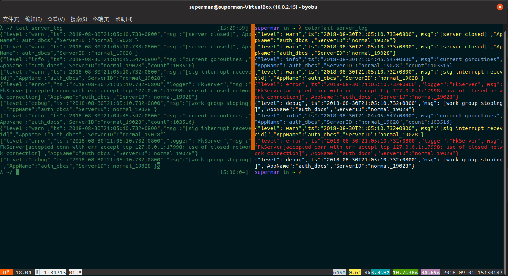

针对go.uber.org/zap日志库写的类似tail命令的工具，针对不同的日志级别采用了不同类型的颜色字体输出，降低日志的甄别难度


### 安装

```
$ go get github.com/LSivan/colorTail

$ go install github.com/LSivan/colorTail

```
验证安装结果
```
$ ls $GOROOT/bin | grep color
colorTail
```


### 用法

```bash
$ colorTail --help
用法: colorTail [选项]... 文件 

选项：
  -f    是否持续监听，缺省表示否
  -n int
        非监听模式下生效，从后往前读取的行数 (default 10)
```

### 效果
